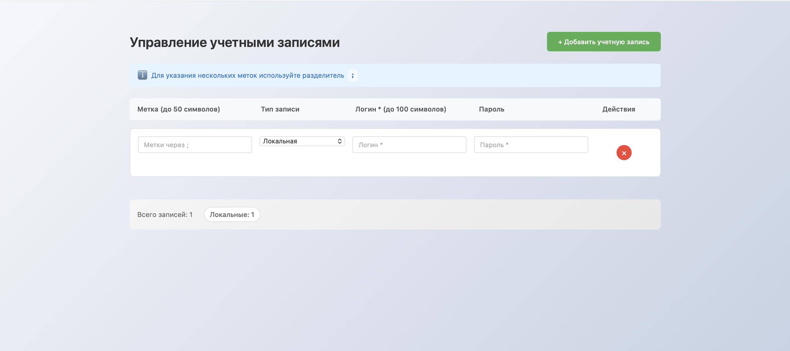

# 📋 Vue Accounts Management Form

Форма управления учетными записями с сохранением в `localStorage`.



## Быстрый старт

```bash
# клонирование текущего репозитория
git clone https://github.com/AndrewSkow24/vue-accounts-form/tree/main
```

```bash
# переход в главную папку проекта
cd vue-accounts-form
```

```bash
# установка зависимостей и запуск проекта
npm install
npm run dev
```

## Функционал

- Добавление/удаление учетных записей
- Два типа: LDAP (без пароля) и Локальные
- Валидация полей (логин обязателен, до 100 символов)
- Метки через ; (преобразуются в массив объектов)
- Сохранение в localStorage
- Адаптивный дизайн

## Стек

- Vue 3 + Composition API
- TypeScript
- Pinia (стейт-менеджер)
- Vite (сборка)

## Структура

- `AccountForm.vue` - основная форма
- `AccountItem.vue` - компонент одной записи
- `accountsStore.ts` - хранилище Pinia

Данные сохраняются между сессиями

## Особенности

- Валидация при потере фокуса
- Красная обводка при ошибках
- Преобразование меток: `"админ;суперадмин" → [{text: "админ"}, {text: "суперадмин"}]`
- Адаптивная сетка (5 колонок на десктопе, 1 на мобильных)
- Приложение запускается на http://localhost:5173
